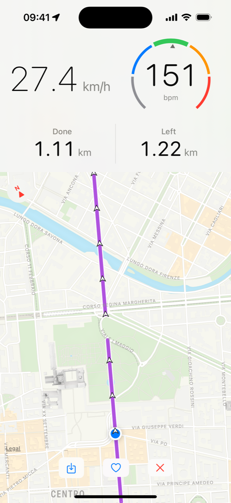

# Velociraptor

A cycling and running dashboard for iPhone. It shows your GPS speed and the heart rate from a Bluetooth chest strap, and it guides you along a GPX route on a map that turns with you, with the distance done and the distance left measured along the route.

Velociraptor is a native SwiftUI app with no third-party dependencies. It uses only Apple frameworks, mainly SwiftUI, Core Location, Core Bluetooth and MapKit.

<p align="center">
  
</p>

## Features

- **Live speed.** Your current GPS speed in km/h, in large type you can read at a glance.
- **Heart rate.** Connect any Bluetooth LE heart rate monitor that uses the standard Heart Rate service: tap the heart rate button, choose your strap from the list, and the bpm appears next to your speed. A gauge shows five training zones (50–100% of max heart rate). Speed keeps working without a monitor.
- **Follow a GPX track.** Import a `.gpx` file from Files. The route is drawn over a map that shows about 1 km² around you and turns with your heading. You can pinch to zoom and drag to look around, then tap the re-centre button to snap back. When the route is off-screen, an arrow points to its nearest point.
- **Distance done / distance left.** Under the speed and heart rate, the app shows how far you have come and how far is left, both measured along the route rather than in a straight line. It handles loops, out-and-back routes and crossings, and it keeps your progress if the app is restarted.
- **Portrait and landscape.** In landscape, the instruments move to side panels so the map gets the middle of the screen.

## Requirements

- iOS 18.2 or later
- Xcode 16 or later
- An iPhone for real use. The simulator can fake a location, but it can't connect to a heart rate monitor.

The app asks for **location (while in use)** for speed and the map, and **Bluetooth** for the heart rate monitor.

## Getting started

```bash
git clone https://github.com/matteo-meluzzi/Velociraptor.git
cd Velociraptor
open Velociraptor.xcodeproj
```

Select the **Velociraptor** scheme and run it on a device or simulator. To install on your own iPhone, set your development team under *Signing & Capabilities*.

From the command line:

```bash
# Build
xcodebuild build -scheme Velociraptor -destination 'platform=iOS Simulator,name=iPhone 16'

# Run all tests
xcodebuild test -scheme Velociraptor -destination 'platform=iOS Simulator,name=iPhone 16'

# Run a single test
xcodebuild test -scheme Velociraptor -destination 'platform=iOS Simulator,name=iPhone 16' \
  -only-testing VelociraptorTests/VelociraptorTests/<TestName>
```

### Trying it with a GPX file

Any GPX 1.1 file with a track (`<trk>`) or route (`<rte>`) works, for example one exported from Strava, Komoot or Garmin Connect. To stress-test with a large file, generate a 50,000-point track:

```bash
swift specs/005-gpx-track-follow/scripts/make-large-gpx.swift 45.0 7.0 > large-50k.gpx
```

The two arguments are the starting latitude and longitude. The track runs about 55 km north from there.

## Project layout

```text
Velociraptor/            App source (SwiftUI views, view models, services)
  VelociraptorApp.swift    Entry point and root layout
  SpeedView.swift          Speed readout
  LocationPublisher.swift  Core Location wrapper
  BluetoothHeartRateService.swift, HeartRate*.swift   BLE heart rate monitor
  GPXParser.swift, Track*.swift, TrackMapView.swift   GPX import, map and track following
  TrackProgress.swift, DistanceBand.swift             Distance done / left along the track
VelociraptorTests/       Unit tests (Swift Testing: @Test, #expect)
VelociraptorUITests/     UI tests (XCTest)
specs/                   Feature specifications, plans and task lists
.specify/                Spec Kit templates and the project constitution
```

## How it is developed

Each feature is built spec-first with [Spec Kit](https://github.com/github/spec-kit). Every feature has a folder under [`specs/`](specs/), which usually contains:

- `spec.md`: what the feature does, with user stories and acceptance scenarios
- `plan.md`, `research.md`, `data-model.md`: how it is built
- `tasks.md`: the ordered implementation tasks
- `quickstart.md`: how to check it by hand on a device

| # | Feature |
|---|---------|
| 001 | [GPS speed display](specs/001-gps-speed-display/) |
| 002 | [Altitude display](specs/002-altitude-display/) |
| 003 | [GPS acceleration plot](specs/003-gps-acceleration-plot/) |
| 004 | [BLE heart rate monitor](specs/004-ble-heart-rate-monitor/) |
| 005 | [GPX track follow](specs/005-gpx-track-follow/) |
| 006 | [GPX distance progress](specs/006-gpx-distance-progress/) |

Altitude (002) and the acceleration plot (003) were specified but are not on the current screen.

The rules every change follows are in the [constitution](.specify/memory/constitution.md). In short, a change is committed only when it builds, all tests pass and it has been reviewed, and the UI is SwiftUI-first, with UIKit used only where SwiftUI has no equivalent.

## Contributing

Issues and pull requests are welcome. For anything larger than a small fix, please open an issue first or start with a spec under `specs/`. Before you open a PR, make sure the build succeeds and all tests pass.
